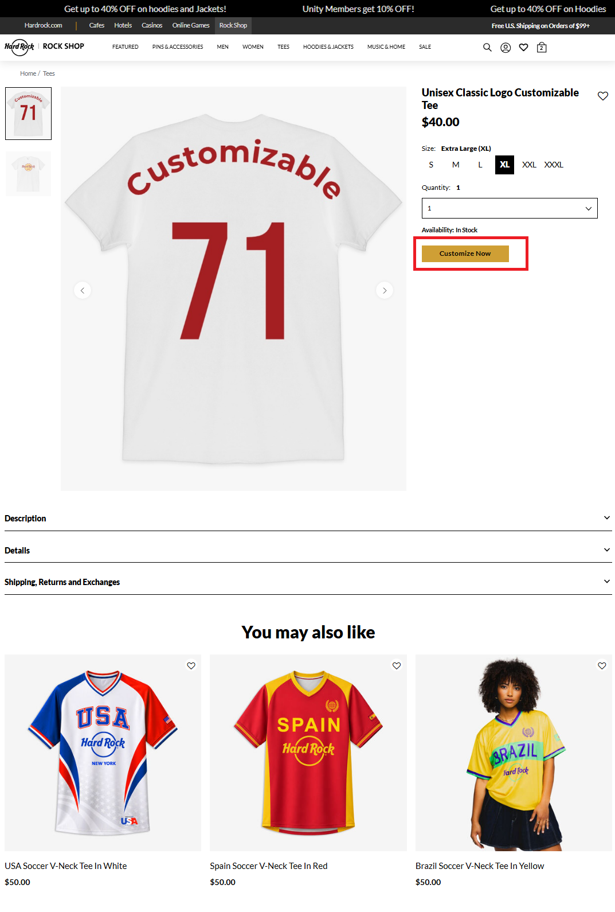
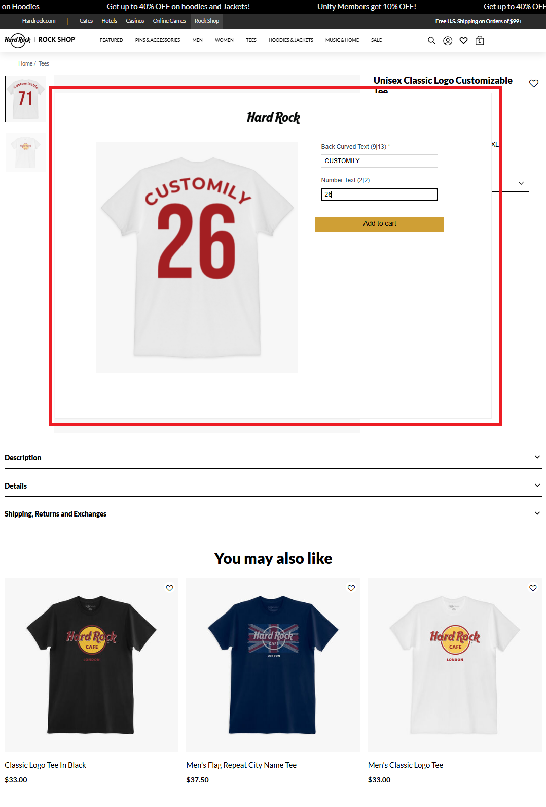
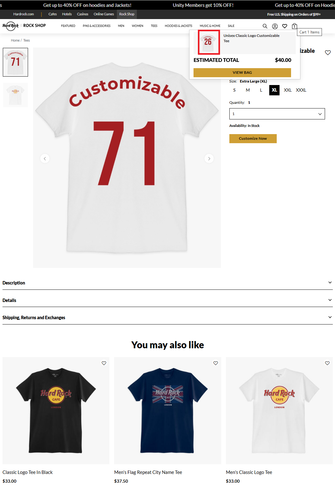

# Customily Standalone Modal Iframe Integration Guide

This guide explains how to integrate Customily's product personalization into any e-commerce platform using a modal iframe. In this approach, the entire Customily experience (live preview + option set form) runs inside a single iframe.

---

## 1. How It Works (End to End)

### Step 1: Product Page with a "Customize" Button

The merchant's product page includes a **Customize** button. This is a regular HTML button — Customily does not inject anything into the page automatically.



### Step 2: Shopper Clicks "Customize" — Modal Opens with Customily Iframe

When the shopper clicks the button, a modal opens containing the full Customily personalization experience inside an iframe. The iframe renders both the live product preview (canvas) and the option set form (text inputs, dropdowns, image uploads, etc.) — no additional scripts or setup required on the host page. The shopper interacts with the Customily UI — typing text, choosing fonts, uploading images, etc. The live preview updates in real time.



### Step 3: Shopper Clicks "Add to Cart" — Personalization Data Sent to Parent Page

When the shopper clicks "Add to Cart", Customily sends the personalization details to the parent page via `postMessage`, including a CDN-hosted thumbnail of the personalized product. The parent page can store this data along with the rest of the order details in their platform's cart.



---

## 2. Implementation Details

### 2.1 The Customily Personalization Link

The Customily personalization link is used as the `src` of the iframe. It has the following format:

```
https://preview-2.customily.com/productViewer?template={TEMPLATE_ID}&set={OPTION_SET_ID}&shop={STORE_URL}
```

| Parameter   | Description                                              |
| ----------- | -------------------------------------------------------- |
| `template`  | The template GUID from Customily                         |
| `set`       | The option set GUID from Customily                       |
| `shop`      | Your store identifier (e.g. `standalone.customily.com`)  |


For example:

```
https://preview-2.customily.com/productViewer?template=0313370a-e3d1-4b88-8640-f1027a78235d&set=53b7ddcc-880d-4303-a495-0338e1388ca2&shop=standalone.customily.com
```

You can create this URL in the Customily dashboard as shown [here](https://help.customily.com/articles/7995314835-connecting-your-templates-with-an-option-set-generating-the-personalization-url)

> **Pro tip:** Add a "Customily Link" field to your admin product details page. This is the way to connect a product from your e-commerce platform to a personalization link on Customily — non-technical team members can simply copy-paste the link from the Customily dashboard without touching code.

### 2.2 Capturing the Personalization Data

When the shopper clicks "Add to Cart" inside the iframe, Customily sends a `postMessage` to the parent window with the personalization payload. Listen for this message and use the data to add the item to your platform's cart:

```javascript
window.addEventListener('message', (event) => {
    const data = event.data;

    // Check that this is a Customily add-to-cart event
    if (data?.action !== 'add-to-cart') return;

    // data contains:
    // - personalizationGUID: unique ID for this personalization
    // - previewUrl:          CDN URL of the personalized preview image
    // - exportedFiles:       array of production file URLs
    // - options:             array of { name, value, type } objects — the options selected by the shopper
    // - quantity:            number of items

    console.log('Personalization GUID:', data.personalizationGUID);
    console.log('Preview image:', data.previewUrl);
    console.log('Options:', data.options);

    // Add the item to your platform's cart. You'll need to pass at least the personalizationId
    addItemToYourCart({
        productId: 'your-platform-product-id',
        personalizationId: data.personalizationGUID,
    });

    // Close the modal
    document.getElementById('customily-modal').style.display = 'none';
});
```

> **Pro tip:** You can add more attributes to your cart item such as `exportedFiles`, `options`, etc. But make sure you hide them from the shopper as it may be confusing for them to see all that info in their cart.

> **Pro tip:** Adding the `previewUrl` as the cart item thumbnail is a great practice that helps the shopper making sure that what they personalized is exactly what they added to the cart

## 3. Complete Example

```html
<!DOCTYPE html>
<html lang="en">
<head>
    <title>Product Page</title>
    <style>
        .modal {
            display: none;
            position: fixed;
            top: 0; left: 0;
            width: 100%; height: 100%;
            background: rgba(0, 0, 0, 0.7);
            z-index: 9999;
            justify-content: center;
            align-items: center;
        }
        .modal.active { display: flex; }
        .modal-content {
            position: relative;
            background: #fff;
            border-radius: 8px;
            width: 90%;
            max-width: 1200px;
            height: 85vh;
            overflow: hidden;
        }
        #customily-iframe {
            width: 100%;
            height: 100%;
            border: none;
        }
        .modal-close {
            position: absolute;
            top: 10px;
            right: 10px;
            z-index: 10;
            background: #fff;
            border: 1px solid #ccc;
            border-radius: 50%;
            width: 32px;
            height: 32px;
            cursor: pointer;
            font-size: 16px;
        }
    </style>
</head>
<body>

    <!-- Product Page -->
    <h1>Personalized Necklace</h1>
    
    <button id="customize-btn">Customize</button>

    <!-- Customily Modal -->
    <div id="customily-modal" class="modal">
        <div class="modal-content">
            <button class="modal-close" id="modal-close">X</button>
            <iframe id="customily-iframe"></iframe>
        </div>
    </div>

    <script>
        // --- Configuration ---
        // Paste the Customily personalization link for this product
        const CUSTOMILY_LINK = 'https://preview-2.customily.com/productViewer?template=0313370a-e3d1-4b88-8640-f1027a78235d&set=53b7ddcc-880d-4303-a495-0338e1388ca2&shop=standalone.customily.com';

        // Open modal on click
        document.getElementById('customize-btn').addEventListener('click', () => {
            document.getElementById('customily-iframe').src = CUSTOMILY_LINK;
            document.getElementById('customily-modal').classList.add('active');
        });

        // Close modal
        document.getElementById('modal-close').addEventListener('click', () => {
            document.getElementById('customily-modal').classList.remove('active');
            document.getElementById('customily-iframe').src = '';
        });

        // Listen for personalization data from the Customily iframe
        window.addEventListener('message', (event) => {
            const data = event.data;
            if (data?.action !== 'add-to-cart') return;

            console.log('Personalization complete:', data);

            // data.previewUrl          → use as the cart thumbnail image
            // data.personalizationGUID → store to retrieve details later
            // data.options             → array of options selected by the shopper
            // data.quantity            → number of items

            // Close modal
            document.getElementById('customily-modal').classList.remove('active');
            document.getElementById('customily-iframe').src = '';

            // Add to your platform's cart here...
        });
    </script>

</body>
</html>
```

---

## 4. API Reference Summary

| Step                  | Method | Endpoint                                                      | Purpose                           |
| --------------------- | ------ | ------------------------------------------------------------- | --------------------------------- |
| Generate PF link      | POST   | `app.customily.com/api/EPSEngrave/GeneratePFRPostOrder`       | Create production file request    |
| Upload preview image  | POST   | `sh-api.customily.com/api/images/preview/save`                | Upload preview, get CDN URL       |
| Create cart record    | POST   | `sh.customily.com/api/standalone/cart?shop={store}`           | Save personalization, get cart ID |
| Retrieve cart item    | GET    | `sh.customily.com/api/standalone/order?search={id}`           | Look up personalization by ID     |
